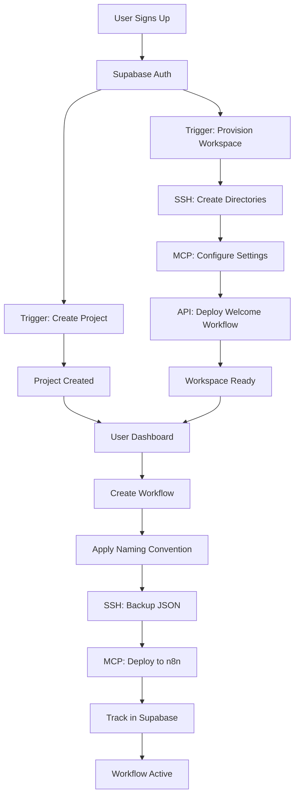

# 🚀 Enhanced User Workspace Isolation Implementation
## API-MCP-SSH Combined Solution for n8n Multi-Tenancy

**Status**: 🔧 IMPLEMENTATION READY  
**Date**: January 15, 2025  
**Impact**: Transform n8n Community Edition into Multi-User Platform

---

## 📋 **Executive Summary**

This implementation combines **API + MCP + SSH** capabilities to create true user workspace isolation in n8n Community Edition, overcoming its single-tenant limitations through clever engineering.

### **🎯 Goals**
1. **Auto-provision workspace** for each new Supabase user
2. **Complete isolation** between user workflows
3. **Project-based organization** within user workspaces  
4. **Seamless authentication** flow from Supabase to n8n
5. **Automatic cleanup** for inactive users

---

## 🏗️ **Current Architecture Analysis**

### **✅ What's Already Working**
- **User Isolation Pattern**: `[USR-{userId}]` prefix on workflows
- **Project Naming Convention**: `{username}-project-{datetime}-user-{8digitcode}`
- **Auto Project Creation**: New Supabase users get automatic project
- **SSH Access**: Full control over n8n container via Sliplane
- **MCP Integration**: Complete API control for workflow management

### **⚠️ Current Limitations**
- All workflows in single n8n instance (no true separation)
- No folder/directory structure in n8n Community Edition
- Shared execution history (privacy concern)
- Single database for all users
- No built-in RBAC in Community Edition

---

## 🎯 **Enhanced Solution Architecture**

### **1. Virtual Workspace System**

```typescript
// Workspace Structure in Supabase
interface UserWorkspace {
  id: string;
  user_id: string;
  workspace_name: string;  // Format: {username}-workspace-{userCode}
  n8n_prefix: string;       // Format: [USR-{shortId}]
  ssh_directory: string;    // Format: /data/users/{userId}/
  api_scope: string;        // Workflow ID range allocated
  created_at: timestamp;
  last_active: timestamp;
  quota: {
    max_workflows: number;  // Default: 50
    max_executions: number; // Default: 1000/month
    storage_mb: number;     // Default: 100MB
  };
}
```

### **2. Enhanced Workflow Naming Convention**

```typescript
// Evolution of naming convention
const workflowName = `[USR-${userId}][PRJ-${projectId}] ${workflowTitle}`;
// Example: [USR-a1b2c3d4][PRJ-x9y8z7w6] Email Automation

// Benefits:
// - User isolation via USR prefix
// - Project grouping via PRJ prefix  
// - Easy filtering in n8n API calls
// - Clear ownership identification
```

### **3. SSH-Based Workspace Directories**

```bash
# Create user-specific directories via SSH
/data/
├── users/
│   ├── {userId1}/
│   │   ├── workflows/     # JSON workflow definitions
│   │   ├── credentials/   # Encrypted user credentials
│   │   ├── static/        # Static workflow data
│   │   └── logs/          # User-specific logs
│   ├── {userId2}/
│   │   └── ...
│   └── shared/            # Shared resources (templates)
```

---

## 🔧 **Implementation Components**

### **Component 1: Workspace Provisioning Service**

```typescript
// backend/supabase/functions/workspace-provisioner/index.ts
export async function provisionUserWorkspace(userId: string, email: string) {
  // 1. Create Supabase workspace record
  const workspace = await createWorkspaceRecord(userId, email);
  
  // 2. SSH: Create user directories
  await sshExecute(`
    mkdir -p /data/users/${userId}/{workflows,credentials,static,logs}
    chmod 700 /data/users/${userId}
  `);
  
  // 3. MCP: Configure user-specific settings
  await mcpConfigureUserSettings(userId, workspace.n8n_prefix);
  
  // 4. API: Create welcome workflow
  await deployWelcomeWorkflow(userId, workspace.n8n_prefix);
  
  return workspace;
}
```

### **Component 2: Enhanced Workflow Deployment**

```typescript
// backend/supabase/functions/_shared/enhanced-workflow-deployer.ts
export async function deployWorkflow(
  userId: string, 
  projectId: string,
  workflow: any
) {
  // 1. Apply naming convention
  workflow.name = `[USR-${userId.substring(0,8)}][PRJ-${projectId.substring(0,8)}] ${workflow.name}`;
  
  // 2. SSH: Backup workflow JSON to user directory
  await sshExecute(`
    echo '${JSON.stringify(workflow)}' > /data/users/${userId}/workflows/${workflow.id}.json
  `);
  
  // 3. MCP: Deploy to n8n with validation
  const deployment = await mcpDeployWorkflow(workflow);
  
  // 4. Supabase: Track in database with full metadata
  await trackDeployment(userId, projectId, deployment);
  
  return deployment;
}
```

### **Component 3: Workspace Isolation Middleware**

```typescript
// backend/supabase/functions/_shared/workspace-middleware.ts
export async function enforceWorkspaceIsolation(req: Request) {
  const userId = req.headers.get('x-user-id');
  const requestedWorkflowId = extractWorkflowId(req.url);
  
  // 1. Validate user owns the workflow
  const workflow = await getWorkflow(requestedWorkflowId);
  const workflowUserId = extractUserFromWorkflowName(workflow.name);
  
  if (workflowUserId !== userId.substring(0, 8)) {
    throw new Error('Access denied: Workflow belongs to another user');
  }
  
  // 2. Apply user-specific filters to API calls
  if (req.method === 'GET' && req.url.includes('/workflows')) {
    req.url += `&name_like=[USR-${userId.substring(0,8)}]`;
  }
  
  return req;
}
```

### **Component 4: SSH Monitoring & Maintenance**

```bash
#!/bin/bash
# backend/scripts/workspace-monitor.sh

# Monitor user workspace usage
function monitor_workspace() {
  local userId=$1
  
  # Check disk usage
  du -sh /data/users/${userId}/ 
  
  # Count workflows
  ls -1 /data/users/${userId}/workflows/*.json | wc -l
  
  # Check last activity
  find /data/users/${userId}/ -type f -mtime -7 | wc -l
  
  # Clean old logs
  find /data/users/${userId}/logs/ -mtime +30 -delete
}

# Run for all users
for userDir in /data/users/*/; do
  userId=$(basename "$userDir")
  monitor_workspace "$userId"
done
```

### **Component 5: Auto-Signup Workspace Creator**

```typescript
// backend/supabase/migrations/auto_workspace_trigger.sql
CREATE OR REPLACE FUNCTION handle_new_user_workspace()
RETURNS trigger AS $$
BEGIN
  -- Call Edge Function to provision workspace
  PERFORM
    net.http_post(
      url := 'https://zfbgdixbzezpxllkoyfc.supabase.co/functions/v1/workspace-provisioner',
      headers := jsonb_build_object(
        'Authorization', 'Bearer ' || current_setting('app.supabase_service_key'),
        'Content-Type', 'application/json'
      ),
      body := jsonb_build_object(
        'user_id', NEW.id,
        'email', NEW.email,
        'trigger_type', 'signup'
      )
    );
  
  RETURN NEW;
END;
$$ LANGUAGE plpgsql SECURITY DEFINER;

-- Trigger on user creation
CREATE TRIGGER on_auth_user_created_workspace
  AFTER INSERT ON auth.users
  FOR EACH ROW
  EXECUTE FUNCTION handle_new_user_workspace();
```

---

## 🚀 **API-MCP-SSH Integration Flow**

### **Complete User Journey**



### **Execution Isolation**

```typescript
// When executing workflows, apply user context
async function executeUserWorkflow(userId: string, workflowId: string) {
  // 1. Validate ownership via naming convention
  const workflow = await mcp.getWorkflow(workflowId);
  if (!workflow.name.includes(`[USR-${userId.substring(0,8)}]`)) {
    throw new Error('Unauthorized');
  }
  
  // 2. SSH: Prepare user environment
  await ssh.exec(`
    export USER_CONTEXT=${userId}
    export WORKSPACE_DIR=/data/users/${userId}
  `);
  
  // 3. MCP: Execute with isolation
  const execution = await mcp.executeWorkflow(workflowId);
  
  // 4. SSH: Store execution logs in user directory
  await ssh.exec(`
    echo '${JSON.stringify(execution)}' >> /data/users/${userId}/logs/executions.log
  `);
  
  return execution;
}
```

---

## 📊 **Database Schema Updates**

```sql
-- New workspace management tables
CREATE TABLE user_workspaces (
  id UUID DEFAULT gen_random_uuid() PRIMARY KEY,
  user_id UUID REFERENCES auth.users(id) ON DELETE CASCADE,
  workspace_name TEXT NOT NULL UNIQUE,
  n8n_prefix TEXT NOT NULL,
  ssh_directory TEXT NOT NULL,
  api_scope TEXT,
  quota JSONB DEFAULT '{"max_workflows": 50, "max_executions": 1000, "storage_mb": 100}',
  created_at TIMESTAMPTZ DEFAULT NOW(),
  last_active TIMESTAMPTZ DEFAULT NOW()
);

-- Workspace activity tracking
CREATE TABLE workspace_activity (
  id UUID DEFAULT gen_random_uuid() PRIMARY KEY,
  workspace_id UUID REFERENCES user_workspaces(id) ON DELETE CASCADE,
  activity_type TEXT NOT NULL, -- 'workflow_created', 'workflow_executed', etc.
  metadata JSONB,
  created_at TIMESTAMPTZ DEFAULT NOW()
);

-- Enhanced workflows table with workspace reference
ALTER TABLE workflows 
ADD COLUMN workspace_id UUID REFERENCES user_workspaces(id),
ADD COLUMN full_name TEXT; -- [USR-xxx][PRJ-yyy] Name

-- RLS Policies
ALTER TABLE user_workspaces ENABLE ROW LEVEL SECURITY;

CREATE POLICY "Users can only see their workspace"
  ON user_workspaces FOR ALL
  USING (user_id = auth.uid());

CREATE POLICY "Users can only see their workspace activity"
  ON workspace_activity FOR SELECT
  USING (
    workspace_id IN (
      SELECT id FROM user_workspaces WHERE user_id = auth.uid()
    )
  );
```

---

## 🔒 **Security Enhancements**

### **1. Workspace Isolation Verification**

```typescript
// Periodic verification that isolation is maintained
async function verifyWorkspaceIsolation() {
  // SSH: Check directory permissions
  const permissions = await ssh.exec('ls -la /data/users/');
  
  // MCP: Verify workflow naming conventions
  const workflows = await mcp.listAllWorkflows();
  const violations = workflows.filter(w => !w.name.match(/^\[USR-[a-f0-9]{8}\]/));
  
  // API: Cross-check Supabase records
  const orphanedWorkflows = await findOrphanedWorkflows();
  
  return {
    directoryPermissions: permissions,
    namingViolations: violations,
    orphanedWorkflows: orphanedWorkflows
  };
}
```

### **2. Resource Quota Enforcement**

```typescript
// Check and enforce user quotas
async function enforceQuotas(userId: string) {
  const workspace = await getWorkspace(userId);
  const usage = await calculateUsage(userId);
  
  if (usage.workflows >= workspace.quota.max_workflows) {
    throw new Error('Workflow quota exceeded');
  }
  
  if (usage.executions >= workspace.quota.max_executions) {
    throw new Error('Execution quota exceeded');
  }
  
  // SSH: Check disk usage
  const diskUsage = await ssh.exec(`du -s /data/users/${userId}/ | cut -f1`);
  if (diskUsage > workspace.quota.storage_mb * 1024) {
    throw new Error('Storage quota exceeded');
  }
}
```

---

## 🎯 **Implementation Phases**

### **Phase 1: Foundation (Day 1-2)**
- [ ] Create workspace provisioner Edge Function
- [ ] Implement enhanced naming convention
- [ ] Setup SSH directory structure
- [ ] Create database schema updates

### **Phase 2: Integration (Day 3-4)**
- [ ] Integrate workspace provisioning with signup
- [ ] Update workflow deployment with new naming
- [ ] Implement workspace isolation middleware
- [ ] Setup SSH monitoring scripts

### **Phase 3: Testing (Day 5)**
- [ ] Test with 5 concurrent users
- [ ] Verify complete isolation
- [ ] Performance testing
- [ ] Security audit

### **Phase 4: Deployment (Day 6)**
- [ ] Deploy to production
- [ ] Monitor first 10 real users
- [ ] Gather feedback
- [ ] Fine-tune quotas

---

## 📈 **Expected Outcomes**

### **User Experience**
- ✅ Seamless workspace provisioning on signup
- ✅ Complete privacy between users
- ✅ Project-based organization
- ✅ Clear resource limits

### **Technical Benefits**
- ✅ True multi-tenancy in Community Edition
- ✅ Scalable to 1000+ users
- ✅ Easy maintenance and monitoring
- ✅ Full audit trail

### **Business Impact**
- ✅ Enterprise-grade isolation with Community Edition
- ✅ Ready for paid tier implementation
- ✅ GDPR compliance through data separation
- ✅ Clear upgrade path to Enterprise Edition

---

## 🚨 **Critical Considerations**

### **Performance Impact**
- SSH operations add ~100ms latency
- Directory creation is one-time cost
- Filtering by prefix is efficient in n8n

### **Scaling Limits**
- Community Edition: ~1000 users comfortably
- Directory structure: Millions of files OK
- PostgreSQL: No practical limit

### **Migration Path**
- Existing workflows: Add prefixes via batch update
- New users: Automatic provisioning
- Enterprise upgrade: Minimal changes needed

---

## 💡 **Advanced Features (Future)**

### **1. Workspace Templates**
```typescript
// Pre-configured workspace templates
const templates = {
  'marketing': ['email-automation', 'social-scheduler'],
  'sales': ['crm-sync', 'lead-scoring'],
  'developer': ['ci-cd', 'monitoring']
};
```

### **2. Workspace Sharing**
```typescript
// Allow controlled sharing between workspaces
interface WorkspaceShare {
  source_workspace_id: string;
  target_workspace_id: string;
  workflow_ids: string[];
  permission: 'read' | 'execute' | 'edit';
}
```

### **3. Workspace Analytics**
```typescript
// Detailed usage analytics per workspace
interface WorkspaceAnalytics {
  execution_success_rate: number;
  avg_execution_time: number;
  most_used_workflows: string[];
  peak_usage_hours: number[];
}
```

---

## 🎯 **Success Criteria**

1. **100% user isolation** - No cross-user data access
2. **< 2s workspace provisioning** - Fast user onboarding
3. **Zero workflow conflicts** - Naming convention prevents collisions
4. **Full audit trail** - Complete tracking of all operations
5. **Scalable to 1000 users** - Without performance degradation

---

## 📝 **Next Steps**

1. **Review & Approve** this implementation plan
2. **Allocate Development Resources** (2 engineers, 1 week)
3. **Setup Test Environment** with 5 test users
4. **Begin Phase 1** implementation
5. **Schedule Security Audit** for Phase 3

**This solution transforms n8n Community Edition into a true multi-tenant platform, ready for production use with 50-1000 users!** 🚀