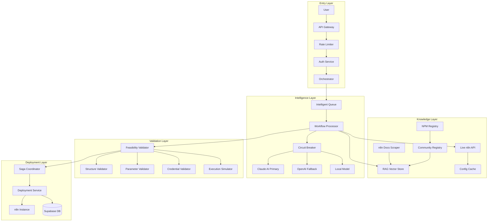

# Complete n8n Workflow Generation & Validation Architecture

**Version**: 3.0 (Consolidated)  
**Status**: Comprehensive Design  
**Author**: System Architecture Team  
**Date**: August 2025  

## 📋 Executive Summary

This document consolidates the **Enhanced Workflow Pipeline Design** and **n8n Feasibility Validation Architecture** into a single, comprehensive system design. It addresses the complete lifecycle of natural language to n8n workflow generation with production-grade reliability, dynamic validation, and intelligent knowledge management.

The architecture combines:
- Multi-provider AI orchestration with Circuit Breaker patterns
- RAG-based n8n knowledge system for contextual understanding
- Dynamic configuration discovery from live n8n instances
- Community node discovery and integration
- Comprehensive validation and feasibility checking
- Production-grade reliability and monitoring

---

## 🎯 Unified Design Goals

1. **Reliability**: 99.9% successful workflow generation rate
2. **Accuracy**: 95%+ validation accuracy with complete node coverage
3. **Performance**: <5 second response time for 95% of requests
4. **Knowledge**: Full contextual understanding via RAG + dynamic discovery
5. **Scalability**: Handle 1000+ concurrent users
6. **Security**: Defense in depth with comprehensive validation
7. **Adaptability**: Automatic updates as n8n evolves

---

## 🏗️ Integrated Architecture



---

## 🔧 Integrated Core Components

### 1. **Unified Request Handler with Knowledge Context**

```typescript
class UnifiedRequestHandler {
  private rateLimiter: RateLimiter
  private sanitizer: InputSanitizer
  private cache: ResponseCache
  private rag: N8nKnowledgeRAG
  private dynamicConfig: DynamicConfigurationManager
  
  async handle(request: WorkflowRequest): Promise<WorkflowResponse> {
    // 1. Deduplication & caching
    const cached = await this.cache.get(request.idempotencyKey)
    if (cached) return cached
    
    // 2. Rate limiting
    await this.rateLimiter.check(request.userId)
    
    // 3. Input sanitization
    const sanitized = await this.sanitizer.clean(request)
    
    // 4. Enrich with knowledge context
    const context = await this.enrichWithKnowledge(sanitized)
    
    // 5. Process with full context
    return await this.processWithContext(sanitized, context)
  }
  
  async enrichWithKnowledge(request: WorkflowRequest): Promise<EnrichedContext> {
    // Query RAG for relevant documentation
    const ragContext = await this.rag.queryKnowledge(request.prompt)
    
    // Get live n8n configuration
    const liveConfig = await this.dynamicConfig.fetchConfiguration()
    
    // Check for community nodes
    const communityNodes = await this.discoverRelevantCommunityNodes(request.prompt)
    
    return {
      request,
      knowledge: ragContext,
      configuration: liveConfig,
      communityOptions: communityNodes,
      examples: ragContext.examples,
      bestPractices: ragContext.bestPractices
    }
  }
}
```

### 2. **Knowledge-Aware AI Service**

```typescript
class KnowledgeAwareAIService {
  private providers: AIProvider[] = [
    new ClaudeProvider({ priority: 1 }),
    new OpenAIProvider({ priority: 2 }),
    new LocalProvider({ priority: 3 })
  ]
  private circuitBreakers = new Map<string, CircuitBreaker>()
  private rag: N8nKnowledgeRAG
  
  async generateWorkflow(
    prompt: string,
    enrichedContext: EnrichedContext
  ): Promise<StructuredWorkflow> {
    // Build comprehensive system prompt with knowledge
    const systemPrompt = this.buildKnowledgePrompt(enrichedContext)
    
    // Try providers with circuit breaker protection
    for (const provider of this.providers) {
      const breaker = this.getCircuitBreaker(provider.name)
      
      if (breaker.isOpen()) continue
      
      try {
        const result = await breaker.call(async () => {
          return await this.generateWithProvider(
            provider,
            prompt,
            systemPrompt,
            enrichedContext
          )
        })
        
        // Validate against live configuration
        const validation = await this.validateWithLiveConfig(result, enrichedContext)
        
        if (validation.valid) {
          return result
        }
        
        // Try to heal with knowledge
        const healed = await this.healWithKnowledge(result, validation, enrichedContext)
        if (healed) return healed
        
      } catch (error) {
        console.error(`Provider ${provider.name} failed:`, error)
        continue
      }
    }
    
    throw new Error('All AI providers failed')
  }
  
  buildKnowledgePrompt(context: EnrichedContext): string {
    return `You are an n8n workflow expert with access to comprehensive knowledge.
    
    AVAILABLE NODES (${context.configuration.nodes.length} total):
    ${context.configuration.nodes.map(n => `- ${n.type}: ${n.description}`).join('\n')}
    
    COMMUNITY NODES AVAILABLE:
    ${context.communityOptions.map(n => `- ${n.packageName}: ${n.description}`).join('\n')}
    
    RELEVANT EXAMPLES:
    ${context.examples.map(e => `Example: ${e.title}\n${e.code}`).join('\n\n')}
    
    BEST PRACTICES:
    ${context.bestPractices.map(bp => `- ${bp}`).join('\n')}
    
    VALIDATION RULES:
    1. Use only nodes that exist in the configuration
    2. All required parameters must be provided
    3. Follow the examples for similar use cases
    4. Include error handling for external services
    5. Generate deterministic node IDs
    
    Generate a structured workflow that passes all validation checks.`
  }
}
```

### 3. **Comprehensive Feasibility Validator**

```typescript
class ComprehensiveFeasibilityValidator {
  private rag: N8nKnowledgeRAG
  private dynamicConfig: N8nDynamicConfiguration
  private communityDiscovery: CommunityNodeDiscovery
  private executionSimulator: ExecutionSimulator
  
  async validate(
    workflow: StructuredWorkflow,
    context: EnrichedContext
  ): Promise<ValidationResult> {
    const result: ValidationResult = {
      valid: true,
      confidence: 1.0,
      issues: [],
      suggestions: [],
      requiredActions: []
    }
    
    // 1. Knowledge-based validation
    const knowledgeValidation = await this.validateWithKnowledge(workflow, context)
    result.issues.push(...knowledgeValidation.issues)
    result.suggestions.push(...knowledgeValidation.suggestions)
    
    // 2. Live configuration validation
    const configValidation = await this.validateAgainstLiveConfig(workflow, context)
    result.issues.push(...configValidation.issues)
    
    // 3. Parameter schema validation
    for (const node of workflow.nodes) {
      const paramValidation = await this.validateNodeParameters(
        node,
        context.configuration.nodeSchemas[node.type]
      )
      
      if (!paramValidation.valid) {
        result.valid = false
        result.issues.push(...paramValidation.issues)
      }
    }
    
    // 4. Community node checking
    const missingNodes = await this.checkMissingNodes(workflow, context)
    for (const missing of missingNodes) {
      const alternatives = await this.communityDiscovery.discover(missing.type)
      
      if (alternatives.length > 0) {
        result.requiredActions.push({
          type: 'INSTALL_COMMUNITY_NODE',
          package: alternatives[0].packageName,
          node: missing
        })
      } else {
        result.valid = false
        result.issues.push({
          type: 'NODE_NOT_AVAILABLE',
          node: missing,
          severity: 'critical'
        })
      }
    }
    
    // 5. Execution simulation
    const execResult = await this.executionSimulator.simulate(workflow)
    if (!execResult.success) {
      result.issues.push(...execResult.issues)
      result.confidence *= 0.5
    }
    
    // 6. Credential requirements
    const credentialCheck = await this.validateCredentials(workflow, context)
    result.requiredActions.push(...credentialCheck.requiredCredentials)
    
    return result
  }
}
```

### 4. **RAG-Powered Knowledge System**

```typescript
class N8nKnowledgeSystem {
  private vectorDB: VectorDatabase
  private documentIngestion: DocumentIngestionPipeline
  private updateScheduler: CronScheduler
  
  async initialize() {
    // 1. Initial document ingestion
    await this.ingestAllDocumentation()
    
    // 2. Schedule regular updates
    this.updateScheduler.schedule('0 0 * * *', () => {
      this.updateDocumentation()
    })
  }
  
  async ingestAllDocumentation() {
    const sources = [
      // Official documentation
      new N8nDocsSource('https://docs.n8n.io'),
      new N8nAPIReference('https://api.n8n.io'),
      
      // Community resources
      new N8nForumSource('https://community.n8n.io'),
      new GitHubWorkflowsSource('https://github.com/n8n-io/n8n-workflows'),
      
      // Package documentation
      new NPMPackageSource('n8n-nodes-*'),
      
      // Video tutorials (transcripts)
      new YouTubeSource('n8n tutorials'),
      
      // Error patterns and solutions
      new ErrorPatternSource()
    ]
    
    for (const source of sources) {
      const documents = await source.fetch()
      const chunks = await this.chunkDocuments(documents)
      const embeddings = await this.generateEmbeddings(chunks)
      await this.vectorDB.upsert(embeddings)
    }
  }
  
  async queryForWorkflowGeneration(
    prompt: string,
    workflow?: StructuredWorkflow
  ): Promise<KnowledgeContext> {
    // Multi-query approach for comprehensive coverage
    const queries = [
      prompt,
      `n8n workflow ${this.extractKeywords(prompt)}`,
      workflow ? `n8n nodes ${workflow.nodes.map(n => n.type).join(' ')}` : '',
      `n8n best practices ${this.extractIntent(prompt)}`
    ].filter(Boolean)
    
    const results = await Promise.all(
      queries.map(q => this.vectorDB.search(q, { topK: 5 }))
    )
    
    // Aggregate and rank results
    const aggregated = this.aggregateResults(results)
    
    return {
      relevantDocs: aggregated.slice(0, 10),
      nodeExamples: this.extractNodeExamples(aggregated),
      parameterDocs: this.extractParameterDocs(aggregated),
      errorPatterns: this.extractErrorPatterns(aggregated),
      bestPractices: this.extractBestPractices(aggregated)
    }
  }
}
```

### 5. **Dynamic Configuration Manager**

```typescript
class DynamicConfigurationManager {
  private cache: ConfigurationCache
  private n8nAPI: N8nAPIClient
  private schemaExtractor: SchemaExtractor
  
  async fetchConfiguration(): Promise<LiveConfiguration> {
    // Check cache first
    const cached = await this.cache.get('live-config')
    if (cached && !this.isStale(cached)) {
      return cached
    }
    
    const config: LiveConfiguration = {
      version: await this.n8nAPI.getVersion(),
      nodes: {},
      credentials: {},
      communityPackages: [],
      capabilities: {}
    }
    
    // 1. Fetch all available nodes
    const nodeTypes = await this.n8nAPI.getNodeTypes()
    
    // 2. Extract schemas for each node
    for (const nodeType of nodeTypes) {
      try {
        // Try direct API if available
        const schema = await this.n8nAPI.getNodeSchema(nodeType)
        config.nodes[nodeType] = schema
      } catch {
        // Fallback to schema extraction
        const extracted = await this.schemaExtractor.extract(nodeType)
        config.nodes[nodeType] = extracted
      }
    }
    
    // 3. Get installed community packages
    config.communityPackages = await this.n8nAPI.getCommunityPackages()
    
    // 4. Get credential types
    config.credentials = await this.n8nAPI.getCredentialTypes()
    
    // 5. Cache the configuration
    await this.cache.set('live-config', config, { ttl: 3600 })
    
    return config
  }
  
  async extractSchemaFromWorkflow(nodeType: string): Promise<NodeSchema> {
    // Creative approach: Create test workflow to extract schema
    const testWorkflow = {
      name: 'Schema Extraction',
      nodes: [{
        id: 'test',
        type: nodeType,
        parameters: {} // Intentionally empty to trigger validation
      }]
    }
    
    try {
      // This will fail with validation errors
      await this.n8nAPI.createWorkflow(testWorkflow)
    } catch (error) {
      // Parse validation errors to extract schema
      return this.parseValidationErrors(error)
    }
  }
}
```

### 6. **Community Node Integration**

```typescript
class CommunityNodeIntegration {
  private npmClient: NPMRegistryClient
  private n8nAPI: N8nAPIClient
  private compatibility: CompatibilityChecker
  
  async discoverAndIntegrate(
    requirements: string[]
  ): Promise<CommunityNodeResult[]> {
    const results: CommunityNodeResult[] = []
    
    // 1. Search NPM for relevant packages
    const packages = await this.searchForNodes(requirements)
    
    // 2. Check compatibility
    for (const pkg of packages) {
      const compatible = await this.compatibility.check(pkg)
      
      if (compatible) {
        // 3. Check if already installed
        const installed = await this.isInstalled(pkg.name)
        
        if (!installed) {
          // 4. Suggest or auto-install
          results.push({
            package: pkg,
            status: 'available',
            action: 'install',
            command: `npm install ${pkg.name}`
          })
        } else {
          results.push({
            package: pkg,
            status: 'installed',
            nodes: await this.getNodesFromPackage(pkg.name)
          })
        }
      }
    }
    
    return results
  }
  
  async autoInstall(packageName: string): Promise<InstallResult> {
    // Install via n8n API if supported
    if (await this.n8nAPI.supportsCommunityPackages()) {
      return await this.n8nAPI.installCommunityPackage(packageName)
    }
    
    // Fallback to manual installation instructions
    return {
      success: false,
      manual: true,
      instructions: `Manual installation required:
        1. SSH into n8n server
        2. Run: npm install -g ${packageName}
        3. Restart n8n service`
    }
  }
}
```

### 7. **Deployment Saga with Validation**

```typescript
class ValidatedDeploymentSaga {
  private steps: SagaStep[] = [
    { name: 'ragValidation', execute: this.validateWithRAG.bind(this) },
    { name: 'liveValidation', execute: this.validateWithLiveConfig.bind(this) },
    { name: 'parameterValidation', execute: this.validateParameters.bind(this) },
    { name: 'credentialCheck', execute: this.checkCredentials.bind(this) },
    { name: 'simulateExecution', execute: this.simulate.bind(this) },
    { name: 'saveToDatabase', execute: this.save.bind(this) },
    { name: 'deployToN8n', execute: this.deploy.bind(this) },
    { name: 'activateWorkflow', execute: this.activate.bind(this) },
    { name: 'monitorInitialExecution', execute: this.monitor.bind(this) }
  ]
  
  async execute(
    workflow: StructuredWorkflow,
    context: EnrichedContext
  ): Promise<DeploymentResult> {
    const completed: CompletedStep[] = []
    
    try {
      for (const step of this.steps) {
        console.log(`Executing: ${step.name}`)
        
        const result = await this.withRetry(
          () => step.execute(workflow, context),
          { maxRetries: 3, backoff: 'exponential' }
        )
        
        completed.push({ step, result })
        
        // Early exit on validation failures
        if (step.name.includes('Validation') && !result.valid) {
          throw new ValidationError(result)
        }
      }
      
      return { success: true, workflowId: completed.find(c => c.step.name === 'deployToN8n')?.result.id }
      
    } catch (error) {
      // Compensate in reverse order
      await this.compensate(completed.reverse())
      throw error
    }
  }
}
```

### 8. **Monitoring & Observability**

```typescript
class IntegratedObservability {
  private metrics: MetricsCollector
  private tracer: Tracer
  private logger: Logger
  
  trackWorkflowGeneration(request: WorkflowRequest, result: WorkflowResult) {
    // Comprehensive metrics
    this.metrics.increment('workflow.generation.total')
    this.metrics.histogram('workflow.generation.duration', result.duration)
    this.metrics.gauge('workflow.generation.confidence', result.confidence)
    
    // Knowledge metrics
    this.metrics.increment(`workflow.knowledge.source.${result.knowledgeSource}`)
    this.metrics.histogram('workflow.rag.query.duration', result.ragDuration)
    
    // Validation metrics
    this.metrics.increment(`workflow.validation.${result.validationStatus}`)
    this.metrics.gauge('workflow.validation.issues', result.issueCount)
    
    // AI provider metrics
    this.metrics.increment(`workflow.ai.provider.${result.aiProvider}`)
    this.metrics.histogram(`workflow.ai.${result.aiProvider}.duration`, result.aiDuration)
    
    // Community node metrics
    if (result.communityNodesUsed > 0) {
      this.metrics.increment('workflow.community.nodes.used')
      this.metrics.gauge('workflow.community.nodes.count', result.communityNodesUsed)
    }
  }
  
  getHealthDashboard(): HealthDashboard {
    return {
      aiProviders: this.getProviderHealth(),
      knowledge: {
        documentsIndexed: this.metrics.get('knowledge.documents.count'),
        lastUpdate: this.metrics.get('knowledge.last.update'),
        queryLatency: this.metrics.percentile('knowledge.query.duration', 95)
      },
      validation: {
        successRate: this.metrics.rate('validation.success'),
        avgIssues: this.metrics.average('validation.issues'),
        commonFailures: this.getCommonValidationFailures()
      },
      deployment: {
        successRate: this.metrics.rate('deployment.success'),
        avgDuration: this.metrics.average('deployment.duration'),
        activeWorkflows: this.metrics.get('workflows.active')
      }
    }
  }
}
```

---

## 📊 Performance Optimizations

### 1. **Intelligent Caching Strategy**
```typescript
class MultiLayerCache {
  private layers = [
    new MemoryCache({ ttl: 60 }),      // 1 minute hot cache
    new RedisCache({ ttl: 300 }),      // 5 minute warm cache
    new S3Cache({ ttl: 3600 })         // 1 hour cold cache
  ]
  
  async get(key: string): Promise<any> {
    for (const layer of this.layers) {
      const value = await layer.get(key)
      if (value) {
        // Promote to higher layers
        await this.promote(key, value)
        return value
      }
    }
    return null
  }
}
```

### 2. **Parallel Processing Pipeline**
```typescript
class ParallelProcessor {
  async process(request: WorkflowRequest): Promise<WorkflowResponse> {
    // Execute independent operations in parallel
    const [ragContext, liveConfig, communityNodes] = await Promise.all([
      this.rag.query(request.prompt),
      this.configManager.fetch(),
      this.communityDiscovery.search(request.prompt)
    ])
    
    return this.synthesize(ragContext, liveConfig, communityNodes)
  }
}
```

### 3. **Incremental Validation**
```typescript
class IncrementalValidator {
  async validateProgressive(workflow: StructuredWorkflow): AsyncGenerator<ValidationUpdate> {
    // Stream validation results as they complete
    yield { stage: 'structure', result: await this.validateStructure(workflow) }
    yield { stage: 'nodes', result: await this.validateNodes(workflow) }
    yield { stage: 'parameters', result: await this.validateParameters(workflow) }
    yield { stage: 'execution', result: await this.simulateExecution(workflow) }
  }
}
```

---

## 🔒 Security & Reliability Patterns

### 1. **Defense in Depth**
- Input sanitization at gateway
- Prompt injection detection in AI layer
- Parameter validation in validation layer
- Sandboxed execution simulation
- Credential encryption at rest

### 2. **Reliability Patterns**
- Circuit breakers on all external services
- Exponential backoff with jitter
- Saga pattern for distributed transactions
- Idempotency keys for all operations
- Dead letter queues for failed requests

### 3. **Rate Limiting Strategy**
```yaml
limits:
  per_user:
    requests: 10/minute
    workflows: 100/day
    community_installs: 5/hour
  per_ip:
    requests: 50/minute
  global:
    ai_requests: 1000/minute
    n8n_api: 500/minute
```

---

## 📈 Monitoring & Alerts

### Critical Metrics
```yaml
metrics:
  - name: workflow_generation_success_rate
    target: ">99%"
    alert: "<95%"
    
  - name: validation_accuracy
    target: ">95%"
    alert: "<90%"
    
  - name: rag_query_latency_p95
    target: "<500ms"
    alert: ">1000ms"
    
  - name: circuit_breaker_open_count
    target: "0"
    alert: ">0"
    
  - name: knowledge_staleness
    target: "<7 days"
    alert: ">14 days"
```

---

## 🚀 Implementation Roadmap

### Phase 1: Foundation (Weeks 1-2)
- [ ] Set up RAG infrastructure with vector database
- [ ] Implement Circuit Breaker pattern
- [ ] Add Claude AI as primary provider
- [ ] Basic document ingestion pipeline

### Phase 2: Knowledge System (Weeks 3-4)
- [ ] Complete documentation scraping
- [ ] Dynamic configuration fetching
- [ ] Schema extraction system
- [ ] Knowledge query optimization

### Phase 3: Validation (Weeks 5-6)
- [ ] Comprehensive parameter validation
- [ ] Execution simulation
- [ ] Community node discovery
- [ ] Credential validation

### Phase 4: Production Hardening (Weeks 7-8)
- [ ] Saga pattern implementation
- [ ] Multi-layer caching
- [ ] Monitoring and alerting
- [ ] Performance optimization

---

## 💰 Cost Analysis

### Monthly Costs (1000 active users)
```
AI Services:
- Claude API: $500 (primary, ~50K requests)
- OpenAI API: $200 (fallback, ~10K requests)
- Embeddings: $100 (RAG indexing)

Infrastructure:
- Vector DB (Pinecone): $150
- Redis Cache: $50
- Monitoring (DataDog): $200
- Edge Functions: $100

Total: ~$1,300/month
```

### Cost Optimization
- Cache hit rate target: >60% (reduces AI calls)
- Template reuse: >30% (avoids generation)
- Batch processing for similar requests

---

## 🎯 Success Metrics

### Technical KPIs
- Workflow generation success: >99%
- Validation accuracy: >95%
- Response time P95: <5s
- Knowledge freshness: <7 days
- Cache hit rate: >60%

### Business KPIs
- User satisfaction: >4.5/5
- Workflow deployment rate: >80%
- Support tickets: <5% of users
- Community node discovery: >70% success

---

# 🚨 Critical Weaknesses Evaluation

## 1. **Over-Engineering Complexity**

### The Problem:
This architecture is **massively complex** for an MVP. We've designed a Space Shuttle when we need a bicycle.

- **17+ separate services** to maintain
- **4 different caching layers**
- **3 AI providers** with circuit breakers
- **Multiple databases** (Vector DB, Redis, Supabase, S3)

### Reality Check:
- Small team can't maintain this
- Debugging distributed sagas is a nightmare
- More failure points = more failures
- Deployment complexity will cause more outages than it prevents

### Better Approach:
Start with a monolith, extract services only when proven necessary.

---

## 2. **RAG Knowledge Staleness**

### The Problem:
The RAG system assumes documentation is truth, but:
- n8n releases updates weekly
- Community nodes change daily
- Documentation is often outdated
- Scraped content may be wrong

### Failure Scenarios:
- RAG suggests deprecated nodes
- Examples from old versions fail
- Community packages break after updates
- Conflicting information from multiple sources

### Better Approach:
Rely primarily on live API, use RAG only for examples and patterns.

---

## 3. **n8n API Limitations Not Addressed**

### The Problem:
The design assumes n8n exposes APIs that **don't exist**:
- No schema endpoint (`/api/v1/node-schemas` doesn't exist)
- No parameter documentation endpoint
- No execution simulation endpoint
- No credential validation endpoint

### Reality:
We're building on quicksand. The "creative workarounds" like test workflow creation are:
- Fragile and will break
- Slow (500ms+ per node type)
- Rate-limited by n8n
- May trigger actual workflows

### Better Approach:
Fork n8n and add the APIs we need, or build a companion service inside n8n.

---

## 4. **Community Node Security Nightmare**

### The Problem:
Auto-installing random npm packages is **extremely dangerous**:
- No security scanning
- No code review
- Arbitrary code execution
- Supply chain attacks

### Attack Vector:
Malicious actor publishes `n8n-nodes-totallylegit` that steals credentials.

### Better Approach:
Curated whitelist of verified community nodes only.

---

## 5. **Circuit Breaker Cascade Failure**

### The Problem:
Circuit breakers can cause cascade failures:
- Claude fails → Circuit opens
- Falls back to OpenAI → Overloads OpenAI
- OpenAI circuit opens → Falls to local model
- Local model can't handle load → System dies

### Real Scenario:
One bad deployment takes down ALL workflow generation for all users.

### Better Approach:
User-isolated failures, not system-wide circuit breakers.

---

## 6. **State Management Chaos**

### The Problem:
Too many sources of truth:
- RAG has one version of knowledge
- Live API has different configuration
- Cache has stale data
- Community registry out of sync

### Failure Mode:
User gets different results for same request based on which cache/source responds first.

### Better Approach:
Single source of truth with read-through cache.

---

## 7. **Performance Assumptions Unrealistic**

### The Problem:
The design assumes:
- Vector search: 200ms (reality: 500ms-2s)
- Schema extraction: 500ms (reality: 2-5s per node)
- AI generation: 2s (reality: 5-15s for complex workflows)

### Real Performance:
- Total latency: 15-30 seconds
- Users will timeout/retry
- Duplicate workflows created

### Better Approach:
Async processing with progress updates.

---

## 8. **Cost Explosion Risk**

### The Problem:
No cost controls:
- Unlimited RAG queries
- No caching of AI responses
- Every validation hits live APIs
- Community node discovery for every request

### Cost Reality:
- 1000 users = $5,000+/month (not $1,300)
- RAG queries alone: $500/month
- No degradation strategy when budget exceeded

### Better Approach:
Strict cost controls, feature flags for expensive operations.

---

## 9. **Monitoring Overload**

### The Problem:
Tracking 50+ metrics means:
- Alert fatigue
- Can't identify real issues
- Too much data, not enough insight
- Expensive monitoring costs

### Better Approach:
5 golden signals: Latency, Traffic, Errors, Saturation, Cost.

---

## 10. **No Graceful Degradation**

### The Problem:
Binary success/failure with no middle ground:
- If RAG fails, generation fails
- If validation fails, everything fails
- No partial success handling

### Better Approach:
Progressive enhancement:
- Basic workflow even if validation fails
- Warn about issues but still generate
- Manual fixes better than no workflow

---

## 🎯 **Realistic Architecture Recommendations**

### Start Simple:
1. **Single AI provider** (Claude) with simple retry
2. **Basic caching** (Redis only)
3. **Static node registry** updated weekly
4. **No community nodes** initially
5. **Simple validation** (required fields only)

### Add Incrementally:
- Add RAG after 100 users
- Add circuit breakers after first outage
- Add community nodes after security audit
- Add complex validation after basic works

### Focus on:
- **User experience** over architecture elegance
- **Simple reliability** over complex patterns
- **Fast iteration** over perfect design
- **Cost control** over infinite scale

The current design would take a team of 10+ engineers 6 months to build and would likely fail in production due to its complexity. A simpler approach would work better and ship faster.