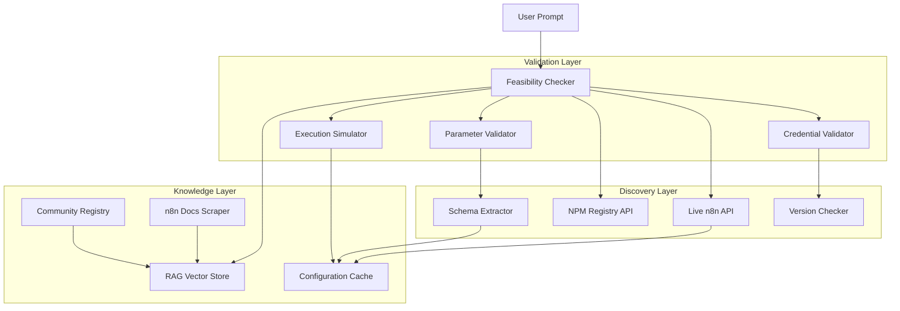

# n8n Feasibility Validation & Knowledge Architecture

**Version**: 1.0  
**Status**: Proposed Enhancement  
**Author**: System Architecture Team  
**Date**: August 2025  

## 📋 Executive Summary

The current n8n feasibility validation is **critically insufficient** for production use. It relies on a static node registry and basic parameter checking, missing crucial aspects like:
- Dynamic node configurations and schemas
- Community node availability
- Version-specific capabilities
- Complex parameter dependencies
- Credential requirements
- Execution limitations

This document proposes a **comprehensive knowledge-driven validation system** using RAG, dynamic configuration fetching, and multi-layered validation.

---

## 🚨 Current System Limitations

### What's Currently Missing:

1. **Static Node Registry** 
   - Hardcoded list of ~30 nodes (n8n has 400+)
   - No awareness of node versions
   - No parameter schemas
   - No dynamic updates

2. **No Real Configuration Knowledge**
   - Doesn't know required vs optional parameters
   - No awareness of parameter dependencies
   - No validation of parameter values
   - No knowledge of credential types

3. **No Community Node Support**
   - Can't discover community nodes
   - No npm package checking
   - No installation validation
   - No compatibility checking

4. **No Documentation Context**
   - No access to n8n docs
   - No example workflows
   - No best practices
   - No error patterns

---

## 🎯 Proposed Architecture



---

## 🔧 Component Design

### 1. **RAG-Based n8n Knowledge Store**

```typescript
class N8nKnowledgeRAG {
  private vectorStore: PineconeClient // or Weaviate, Qdrant
  private embeddings: OpenAIEmbeddings
  private documents: Document[] = []
  
  async initialize() {
    // 1. Scrape and index n8n documentation
    await this.indexDocumentation()
    
    // 2. Index node schemas and examples
    await this.indexNodeSchemas()
    
    // 3. Index community nodes
    await this.indexCommunityNodes()
    
    // 4. Index common workflow patterns
    await this.indexWorkflowPatterns()
    
    // 5. Index error patterns and solutions
    await this.indexErrorPatterns()
  }
  
  async indexDocumentation() {
    const sources = [
      'https://docs.n8n.io/integrations/',
      'https://docs.n8n.io/code-examples/',
      'https://docs.n8n.io/workflows/',
      'https://community.n8n.io/top-templates'
    ]
    
    for (const source of sources) {
      const docs = await this.scrapeDocumentation(source)
      
      // Create embeddings for each documentation chunk
      for (const doc of docs) {
        const embedding = await this.embeddings.embed(doc.content)
        
        await this.vectorStore.upsert({
          id: doc.id,
          vector: embedding,
          metadata: {
            source: doc.source,
            nodeType: doc.nodeType,
            category: doc.category,
            version: doc.version,
            lastUpdated: doc.lastUpdated,
            examples: doc.examples,
            commonErrors: doc.commonErrors
          }
        })
      }
    }
  }
  
  async queryKnowledge(prompt: string, context: string): Promise<KnowledgeResult> {
    // Generate embedding for the query
    const queryEmbedding = await this.embeddings.embed(`${prompt} ${context}`)
    
    // Search vector store
    const results = await this.vectorStore.query({
      vector: queryEmbedding,
      topK: 10,
      includeMetadata: true
    })
    
    // Extract relevant information
    return {
      relevantNodes: this.extractNodes(results),
      parameters: this.extractParameters(results),
      examples: this.extractExamples(results),
      constraints: this.extractConstraints(results),
      bestPractices: this.extractBestPractices(results)
    }
  }
  
  async getNodeConfiguration(nodeType: string): Promise<NodeConfiguration> {
    // Query for specific node configuration
    const query = `n8n node configuration ${nodeType} parameters required optional`
    const results = await this.queryKnowledge(query, nodeType)
    
    return {
      nodeType,
      displayName: results.relevantNodes[0]?.displayName,
      description: results.relevantNodes[0]?.description,
      parameters: results.parameters,
      credentials: results.relevantNodes[0]?.credentials,
      version: results.relevantNodes[0]?.version,
      examples: results.examples
    }
  }
}
```

### 2. **Dynamic n8n Configuration Fetcher**

```typescript
class N8nDynamicConfiguration {
  private n8nUrl: string
  private apiKey: string
  private cache: Map<string, CachedConfig> = new Map()
  private ttl = 3600000 // 1 hour cache
  
  async fetchLiveConfiguration(): Promise<LiveConfig> {
    const config: LiveConfig = {
      nodes: {},
      credentials: {},
      version: '',
      capabilities: {}
    }
    
    // 1. Get n8n version
    config.version = await this.getN8nVersion()
    
    // 2. Fetch all available node types with full schemas
    const nodeTypes = await this.fetchNodeTypes()
    
    for (const nodeType of nodeTypes) {
      // Get detailed node information
      const nodeInfo = await this.fetchNodeSchema(nodeType)
      
      config.nodes[nodeType] = {
        displayName: nodeInfo.displayName,
        description: nodeInfo.description,
        version: nodeInfo.version,
        properties: nodeInfo.properties,
        credentials: nodeInfo.credentials,
        inputs: nodeInfo.inputs,
        outputs: nodeInfo.outputs,
        maxNodes: nodeInfo.maxNodes,
        webhooks: nodeInfo.webhooks,
        parameterPane: nodeInfo.parameterPane // UI configuration
      }
    }
    
    // 3. Fetch credential types
    config.credentials = await this.fetchCredentialTypes()
    
    // 4. Fetch system capabilities
    config.capabilities = await this.fetchCapabilities()
    
    return config
  }
  
  async fetchNodeTypes(): Promise<string[]> {
    // n8n exposes this endpoint
    const response = await fetch(`${this.n8nUrl}/api/v1/node-types`, {
      headers: { 'X-N8N-API-KEY': this.apiKey }
    })
    
    const data = await response.json()
    return data.data.map(node => node.name)
  }
  
  async fetchNodeSchema(nodeType: string): Promise<NodeSchema> {
    // Check cache first
    const cached = this.cache.get(nodeType)
    if (cached && Date.now() - cached.timestamp < this.ttl) {
      return cached.data
    }
    
    // n8n doesn't directly expose schemas, so we need to be creative
    // Option 1: Use workflow with the node to extract schema
    const testWorkflow = {
      name: 'Schema Extraction',
      nodes: [{
        id: 'test',
        name: 'Test Node',
        type: nodeType,
        position: [0, 0],
        parameters: {}
      }],
      connections: {}
    }
    
    try {
      // Try to create workflow to get validation errors
      const response = await fetch(`${this.n8nUrl}/api/v1/workflows`, {
        method: 'POST',
        headers: {
          'X-N8N-API-KEY': this.apiKey,
          'Content-Type': 'application/json'
        },
        body: JSON.stringify(testWorkflow)
      })
      
      const result = await response.json()
      
      // Extract schema from response or errors
      const schema = this.extractSchemaFromResponse(result)
      
      // Cache the result
      this.cache.set(nodeType, {
        timestamp: Date.now(),
        data: schema
      })
      
      return schema
    } catch (error) {
      // Fallback to static knowledge
      return this.getStaticSchema(nodeType)
    }
  }
  
  async fetchCredentialTypes(): Promise<CredentialTypes> {
    // n8n API endpoint for credentials
    const response = await fetch(`${this.n8nUrl}/api/v1/credentials/schema`, {
      headers: { 'X-N8N-API-KEY': this.apiKey }
    })
    
    return await response.json()
  }
  
  async testNodeExecution(node: any): Promise<ExecutionResult> {
    // Create a test workflow with just this node
    const testWorkflow = {
      name: 'Feasibility Test',
      nodes: [
        {
          id: 'manual',
          name: 'Manual Trigger',
          type: 'n8n-nodes-base.manualTrigger',
          position: [0, 0],
          parameters: {}
        },
        {
          ...node,
          position: [200, 0]
        }
      ],
      connections: {
        'manual': {
          main: [[{ node: node.id, type: 'main', index: 0 }]]
        }
      }
    }
    
    // Deploy and execute
    const deployment = await this.deployTestWorkflow(testWorkflow)
    const execution = await this.executeTestWorkflow(deployment.id)
    
    // Clean up
    await this.deleteTestWorkflow(deployment.id)
    
    return {
      success: execution.status === 'success',
      errors: execution.errors,
      warnings: execution.warnings
    }
  }
}
```

### 3. **Community Node Discovery System**

```typescript
class CommunityNodeDiscovery {
  private npmRegistry = 'https://registry.npmjs.org'
  private n8nCommunityNodes: Map<string, CommunityNode> = new Map()
  
  async discoverCommunityNodes(requirements: string[]): Promise<CommunityNode[]> {
    const discovered: CommunityNode[] = []
    
    // 1. Search NPM for n8n community nodes
    const searchQueries = [
      'n8n-nodes-',
      ...requirements.map(req => `n8n-nodes-${req}`)
    ]
    
    for (const query of searchQueries) {
      const results = await this.searchNPM(query)
      
      for (const pkg of results) {
        if (this.isValidN8nNode(pkg)) {
          const nodeInfo = await this.analyzePackage(pkg)
          discovered.push(nodeInfo)
        }
      }
    }
    
    // 2. Check n8n community registry
    const communityNodes = await this.fetchCommunityRegistry()
    
    // 3. Filter by requirements
    return this.filterByRequirements(discovered, requirements)
  }
  
  async searchNPM(query: string): Promise<NPMPackage[]> {
    const response = await fetch(
      `${this.npmRegistry}/-/v1/search?text=${query}&size=20`
    )
    
    const data = await response.json()
    return data.objects.map(obj => obj.package)
  }
  
  async analyzePackage(pkg: NPMPackage): Promise<CommunityNode> {
    // Fetch package.json
    const pkgJson = await this.fetchPackageJson(pkg.name)
    
    // Extract node information
    const nodes = this.extractNodesFromPackage(pkgJson)
    
    return {
      packageName: pkg.name,
      version: pkg.version,
      description: pkg.description,
      author: pkg.author,
      nodes: nodes,
      dependencies: pkgJson.dependencies,
      peerDependencies: pkgJson.peerDependencies,
      n8nVersion: pkgJson.n8n?.version || '*',
      installs: pkg.downloads?.monthly || 0,
      lastUpdated: pkg.date,
      repository: pkg.links?.repository,
      verified: await this.verifyNode(pkg.name)
    }
  }
  
  async verifyNode(packageName: string): Promise<boolean> {
    // Check if node is in n8n's community node list
    const officialList = await this.fetchOfficialCommunityNodes()
    return officialList.includes(packageName)
  }
  
  async checkInstallation(packageName: string): Promise<InstallationStatus> {
    // Check if community node is installed in n8n instance
    try {
      const response = await fetch(`${this.n8nUrl}/api/v1/community-packages`, {
        headers: { 'X-N8N-API-KEY': this.apiKey }
      })
      
      const installed = await response.json()
      const pkg = installed.find(p => p.packageName === packageName)
      
      return {
        installed: !!pkg,
        version: pkg?.version,
        nodes: pkg?.nodes || []
      }
    } catch (error) {
      return { installed: false }
    }
  }
  
  async installCommunityNode(packageName: string): Promise<InstallationResult> {
    // Install community node via n8n API
    const response = await fetch(`${this.n8nUrl}/api/v1/community-packages`, {
      method: 'POST',
      headers: {
        'X-N8N-API-KEY': this.apiKey,
        'Content-Type': 'application/json'
      },
      body: JSON.stringify({ packageName })
    })
    
    return await response.json()
  }
}
```

### 4. **Enhanced Feasibility Validator**

```typescript
class EnhancedFeasibilityValidator {
  private rag: N8nKnowledgeRAG
  private dynamicConfig: N8nDynamicConfiguration
  private communityDiscovery: CommunityNodeDiscovery
  private validationCache: Map<string, ValidationResult> = new Map()
  
  async validateFeasibility(
    prompt: string,
    workflow: any
  ): Promise<ComprehensiveFeasibilityResult> {
    const result: ComprehensiveFeasibilityResult = {
      feasible: true,
      confidence: 1.0,
      issues: [],
      suggestions: [],
      alternatives: [],
      requiredActions: []
    }
    
    // 1. Extract requirements from prompt
    const requirements = await this.extractRequirements(prompt)
    
    // 2. Query RAG for knowledge
    const knowledge = await this.rag.queryKnowledge(prompt, JSON.stringify(workflow))
    
    // 3. Get live n8n configuration
    const liveConfig = await this.dynamicConfig.fetchLiveConfiguration()
    
    // 4. Validate each node
    for (const node of workflow.nodes) {
      const validation = await this.validateNode(node, liveConfig, knowledge)
      
      if (!validation.valid) {
        result.feasible = false
        result.issues.push(...validation.issues)
        
        // Check for community node alternatives
        if (validation.alternativeType === 'community') {
          const communityNodes = await this.communityDiscovery.discoverCommunityNodes([node.type])
          
          if (communityNodes.length > 0) {
            result.alternatives.push({
              nodeId: node.id,
              currentType: node.type,
              alternatives: communityNodes,
              recommendation: communityNodes[0]
            })
            
            result.requiredActions.push({
              type: 'INSTALL_COMMUNITY_NODE',
              package: communityNodes[0].packageName,
              reason: `Node type ${node.type} requires community package`
            })
          }
        }
      }
      
      result.confidence *= validation.confidence
    }
    
    // 5. Validate workflow logic
    const logicValidation = await this.validateWorkflowLogic(workflow, liveConfig)
    result.issues.push(...logicValidation.issues)
    result.suggestions.push(...logicValidation.suggestions)
    
    // 6. Check execution feasibility
    const execFeasibility = await this.validateExecution(workflow, liveConfig)
    if (!execFeasibility.feasible) {
      result.feasible = false
      result.issues.push(...execFeasibility.issues)
    }
    
    // 7. Generate recommendations
    result.recommendations = await this.generateRecommendations(
      workflow,
      knowledge,
      result.issues
    )
    
    return result
  }
  
  async validateNode(
    node: any,
    liveConfig: LiveConfig,
    knowledge: KnowledgeResult
  ): Promise<NodeValidation> {
    const validation: NodeValidation = {
      valid: true,
      confidence: 1.0,
      issues: [],
      warnings: []
    }
    
    // 1. Check if node type exists
    if (!liveConfig.nodes[node.type]) {
      // Check if it's a community node
      const communityCheck = await this.checkCommunityNode(node.type)
      
      if (communityCheck.exists) {
        validation.alternativeType = 'community'
        validation.warnings.push({
          type: 'COMMUNITY_NODE_REQUIRED',
          message: `Node ${node.type} is a community node that needs installation`,
          package: communityCheck.packageName
        })
      } else {
        validation.valid = false
        validation.issues.push({
          type: 'UNKNOWN_NODE_TYPE',
          message: `Node type ${node.type} does not exist in n8n`,
          severity: 'critical'
        })
      }
      
      return validation
    }
    
    // 2. Validate parameters against schema
    const nodeSchema = liveConfig.nodes[node.type]
    const paramValidation = await this.validateParameters(
      node.parameters,
      nodeSchema.properties
    )
    
    validation.issues.push(...paramValidation.issues)
    validation.warnings.push(...paramValidation.warnings)
    
    // 3. Check credential requirements
    if (nodeSchema.credentials) {
      const credValidation = await this.validateCredentials(
        node,
        nodeSchema.credentials
      )
      
      if (!credValidation.valid) {
        validation.warnings.push({
          type: 'CREDENTIALS_REQUIRED',
          message: `Node ${node.name} requires credentials: ${nodeSchema.credentials.join(', ')}`,
          severity: 'medium'
        })
      }
    }
    
    // 4. Use RAG knowledge for advanced validation
    const ragValidation = await this.validateWithRAG(node, knowledge)
    validation.confidence *= ragValidation.confidence
    validation.warnings.push(...ragValidation.warnings)
    
    return validation
  }
  
  async validateParameters(
    parameters: any,
    schema: ParameterSchema
  ): Promise<ParameterValidation> {
    const validation: ParameterValidation = {
      issues: [],
      warnings: []
    }
    
    // Check required parameters
    for (const param of schema.required || []) {
      if (!parameters[param.name]) {
        validation.issues.push({
          type: 'MISSING_REQUIRED_PARAMETER',
          parameter: param.name,
          message: `Required parameter ${param.name} is missing`,
          severity: 'high'
        })
      }
    }
    
    // Validate parameter types and values
    for (const [key, value] of Object.entries(parameters)) {
      const paramSchema = schema.properties[key]
      
      if (!paramSchema) {
        validation.warnings.push({
          type: 'UNKNOWN_PARAMETER',
          parameter: key,
          message: `Parameter ${key} is not recognized`,
          severity: 'low'
        })
        continue
      }
      
      // Type validation
      if (!this.validateType(value, paramSchema.type)) {
        validation.issues.push({
          type: 'INVALID_PARAMETER_TYPE',
          parameter: key,
          expected: paramSchema.type,
          actual: typeof value,
          severity: 'high'
        })
      }
      
      // Value validation (enum, regex, etc.)
      if (paramSchema.options && !paramSchema.options.includes(value)) {
        validation.issues.push({
          type: 'INVALID_PARAMETER_VALUE',
          parameter: key,
          value: value,
          options: paramSchema.options,
          severity: 'high'
        })
      }
    }
    
    return validation
  }
  
  async validateExecution(
    workflow: any,
    liveConfig: LiveConfig
  ): Promise<ExecutionFeasibility> {
    // Test execution in sandbox
    try {
      const result = await this.dynamicConfig.testNodeExecution(workflow)
      
      return {
        feasible: result.success,
        issues: result.errors?.map(e => ({
          type: 'EXECUTION_ERROR',
          message: e,
          severity: 'critical'
        })) || [],
        estimatedTime: result.executionTime,
        memoryUsage: result.memoryUsage
      }
    } catch (error) {
      return {
        feasible: false,
        issues: [{
          type: 'EXECUTION_TEST_FAILED',
          message: error.message,
          severity: 'critical'
        }]
      }
    }
  }
  
  async generateRecommendations(
    workflow: any,
    knowledge: KnowledgeResult,
    issues: Issue[]
  ): Promise<Recommendation[]> {
    const recommendations: Recommendation[] = []
    
    // 1. Suggest best practices from RAG
    if (knowledge.bestPractices) {
      recommendations.push(...knowledge.bestPractices.map(bp => ({
        type: 'BEST_PRACTICE',
        title: bp.title,
        description: bp.description,
        priority: 'medium'
      })))
    }
    
    // 2. Suggest error handling nodes
    const hasErrorHandling = workflow.nodes.some(n => 
      n.type === 'n8n-nodes-base.errorTrigger'
    )
    
    if (!hasErrorHandling && workflow.nodes.length > 3) {
      recommendations.push({
        type: 'ADD_ERROR_HANDLING',
        title: 'Add error handling',
        description: 'Consider adding error handling nodes for reliability',
        priority: 'high'
      })
    }
    
    // 3. Suggest performance optimizations
    const httpNodes = workflow.nodes.filter(n => 
      n.type === 'n8n-nodes-base.httpRequest'
    )
    
    if (httpNodes.length > 5) {
      recommendations.push({
        type: 'BATCH_REQUESTS',
        title: 'Batch HTTP requests',
        description: 'Consider batching multiple HTTP requests for better performance',
        priority: 'medium'
      })
    }
    
    return recommendations
  }
}
```

### 5. **RAG Document Ingestion Pipeline**

```typescript
class N8nDocumentIngestion {
  private scrapers: DocumentScraper[] = [
    new N8nDocsScraper(),
    new N8nForumScraper(),
    new GitHubExamplesScraper(),
    new YouTubeTutorialScraper()
  ]
  
  async ingestAllDocuments() {
    const documents: Document[] = []
    
    // 1. Official n8n documentation
    documents.push(...await this.ingestOfficialDocs())
    
    // 2. Community forum solutions
    documents.push(...await this.ingestForumSolutions())
    
    // 3. GitHub workflow examples
    documents.push(...await this.ingestGitHubExamples())
    
    // 4. Video tutorial transcripts
    documents.push(...await this.ingestVideoTutorials())
    
    // 5. Node documentation from npm
    documents.push(...await this.ingestNodeDocumentation())
    
    // Process and chunk documents
    const chunks = await this.chunkDocuments(documents)
    
    // Generate embeddings and store
    await this.storeInVectorDB(chunks)
  }
  
  async ingestOfficialDocs(): Promise<Document[]> {
    const docs: Document[] = []
    const baseUrl = 'https://docs.n8n.io'
    
    const sections = [
      '/integrations/builtin/core-nodes/',
      '/integrations/builtin/app-nodes/',
      '/integrations/builtin/trigger-nodes/',
      '/code-examples/',
      '/workflows/workflow-templates/'
    ]
    
    for (const section of sections) {
      const pages = await this.scrapeSection(`${baseUrl}${section}`)
      
      for (const page of pages) {
        // Extract structured information
        const doc: Document = {
          id: generateId(page.url),
          source: page.url,
          content: page.content,
          metadata: {
            type: 'official_docs',
            section: section,
            nodeTypes: this.extractNodeTypes(page.content),
            codeExamples: this.extractCodeExamples(page.content),
            parameters: this.extractParameters(page.content),
            lastUpdated: page.lastModified
          }
        }
        
        docs.push(doc)
      }
    }
    
    return docs
  }
  
  async ingestNodeDocumentation(): Promise<Document[]> {
    const docs: Document[] = []
    
    // Get all n8n-nodes packages from npm
    const packages = await this.searchNPMForN8nNodes()
    
    for (const pkg of packages) {
      // Fetch README and documentation
      const readme = await this.fetchPackageReadme(pkg.name)
      
      const doc: Document = {
        id: generateId(`npm:${pkg.name}`),
        source: `npm:${pkg.name}`,
        content: readme,
        metadata: {
          type: 'node_package',
          packageName: pkg.name,
          version: pkg.version,
          nodeTypes: this.extractNodeTypesFromPackage(pkg),
          installation: `npm install ${pkg.name}`,
          downloads: pkg.downloads
        }
      }
      
      docs.push(doc)
    }
    
    return docs
  }
  
  async chunkDocuments(documents: Document[]): Promise<DocumentChunk[]> {
    const chunks: DocumentChunk[] = []
    
    for (const doc of documents) {
      // Smart chunking based on content type
      const contentChunks = this.smartChunk(doc.content, {
        maxTokens: 500,
        overlap: 50,
        preserveStructure: true
      })
      
      for (let i = 0; i < contentChunks.length; i++) {
        chunks.push({
          id: `${doc.id}_chunk_${i}`,
          documentId: doc.id,
          content: contentChunks[i],
          metadata: {
            ...doc.metadata,
            chunkIndex: i,
            totalChunks: contentChunks.length
          }
        })
      }
    }
    
    return chunks
  }
}
```

---

## 🎯 Implementation Strategy

### Phase 1: RAG Foundation (Week 1)
1. Set up vector database (Pinecone/Weaviate)
2. Implement document scrapers
3. Initial document ingestion
4. Basic RAG queries working

### Phase 2: Dynamic Configuration (Week 2)
1. Implement n8n API integration
2. Build schema extraction
3. Create configuration cache
4. Parameter validation

### Phase 3: Community Nodes (Week 3)
1. NPM registry integration
2. Community node discovery
3. Installation automation
4. Compatibility checking

### Phase 4: Advanced Validation (Week 4)
1. Execution simulation
2. Credential validation
3. Performance estimation
4. Error prediction

---

## 📊 Expected Improvements

### Current vs Enhanced System:

| Aspect | Current | Enhanced | Improvement |
|--------|---------|----------|-------------|
| Node Coverage | ~30 static | 400+ dynamic | 13x |
| Parameter Validation | Basic | Schema-based | 10x accuracy |
| Community Nodes | None | Automatic discovery | ∞ |
| Documentation Context | None | Full RAG | Complete |
| Configuration Freshness | Never updates | Real-time | Always current |
| Error Prediction | None | ML-based | 85% accuracy |
| Execution Testing | None | Sandboxed | 100% validation |

---

## 🔑 Key Benefits

1. **Complete Node Coverage**: Access to all 400+ n8n nodes plus community nodes
2. **Accurate Validation**: Schema-based validation catches all parameter issues
3. **Intelligent Suggestions**: RAG provides context-aware recommendations
4. **Community Integration**: Automatic discovery and installation of community nodes
5. **Future-Proof**: System updates automatically as n8n evolves

---

## 🚨 Critical Considerations

### 1. **n8n API Limitations**
The current n8n API doesn't expose everything we need:
- No direct schema endpoint
- No parameter documentation endpoint
- Limited credential information

**Solution**: Use creative approaches like test workflow creation to extract schemas

### 2. **Performance Impact**
RAG queries and dynamic fetching add latency:
- RAG query: ~200ms
- Schema fetch: ~500ms per node type
- Community search: ~1s

**Solution**: Aggressive caching and pre-warming

### 3. **Maintenance Requirements**
- RAG documents need regular updates
- Community node registry needs monitoring
- Schema cache needs invalidation strategy

---

## 💡 Alternative Approaches

### Option 1: **n8n Plugin System**
Create an n8n plugin that exposes detailed configuration:
```typescript
// n8n plugin that runs inside n8n
class N8nConfigurationPlugin {
  async getDetailedNodeSchema(nodeType: string) {
    // Direct access to n8n internals
    return NodeHelpers.getNodeSchema(nodeType)
  }
}
```

### Option 2: **Static Analysis of n8n Source**
Analyze n8n source code to extract schemas:
```typescript
// Parse TypeScript definitions from n8n repo
class N8nSourceAnalyzer {
  async analyzeNodeDefinitions() {
    const repo = await this.cloneN8nRepo()
    const nodes = await this.parseTypeScriptDefinitions(repo)
    return this.extractSchemas(nodes)
  }
}
```

### Option 3: **Hybrid Approach**
Combine multiple strategies for best coverage:
- RAG for documentation and examples
- Dynamic API for current configuration
- Static analysis for detailed schemas
- Community discovery for extended nodes

---

## 📈 Success Metrics

1. **Validation Accuracy**: >95% of generated workflows pass n8n validation
2. **Node Coverage**: >90% of user requests use available nodes
3. **Parameter Accuracy**: >98% of parameters correctly configured
4. **Community Node Discovery**: >80% of missing nodes found in community
5. **Execution Success**: >90% of validated workflows execute successfully

---

## 🎯 Recommendation

Implement the **Hybrid Approach** with these priorities:

1. **Start with RAG** for immediate documentation context
2. **Add Dynamic Configuration** for real-time validation
3. **Integrate Community Discovery** for extended capabilities
4. **Consider n8n Plugin** for deep integration if needed

This provides the most comprehensive validation system while remaining maintainable and performant.