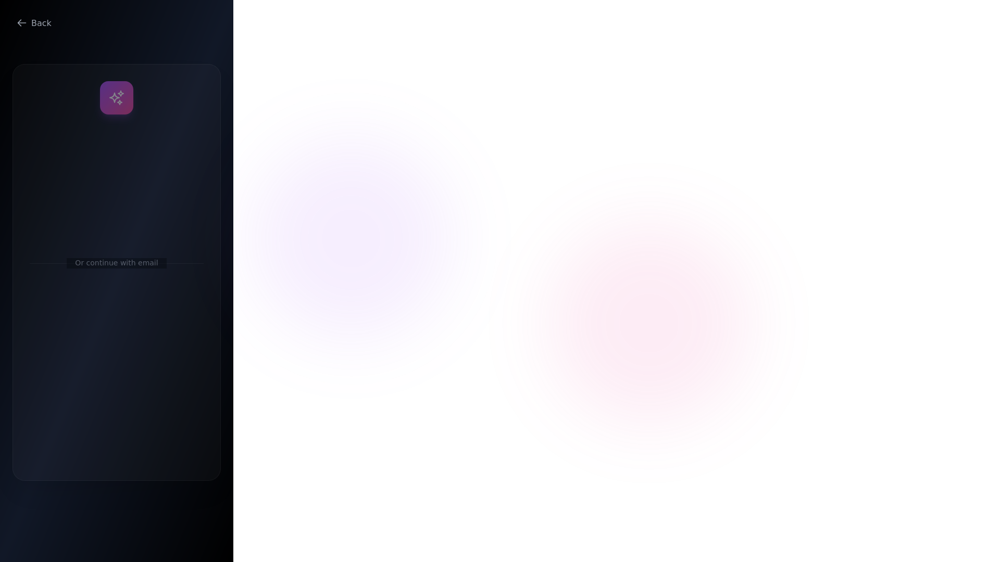
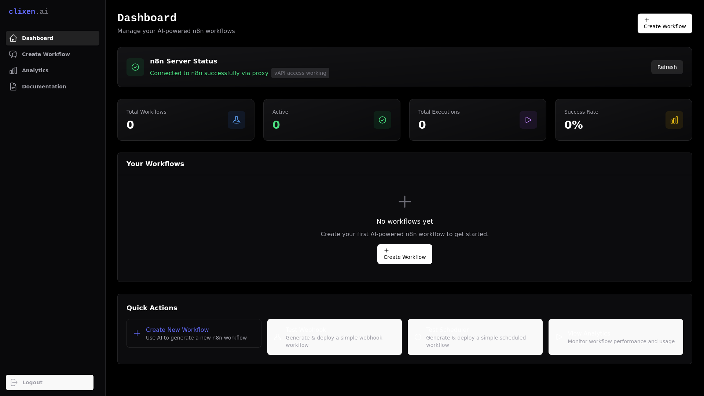
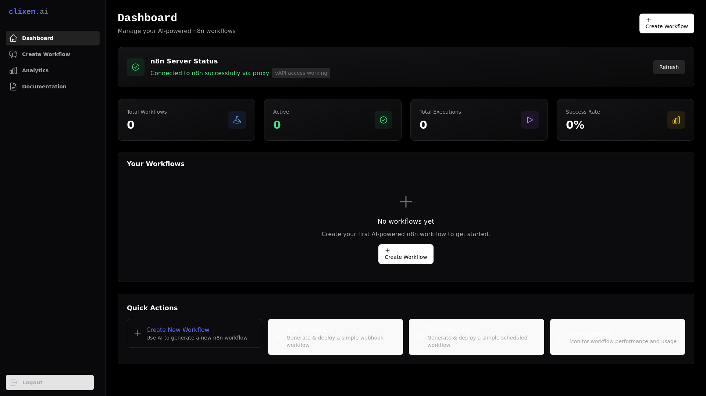
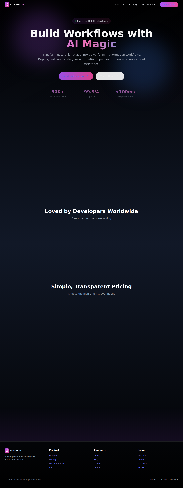

# Clixen E2E Test Report

**Generated:** 2025-08-04T20:06:30.741Z
**Target URL:** https://clixen.netlify.app

## 📸 Screenshots Captured

Total screenshots: **6**

- 
- 
- 
- 
- 
- 

## 📊 Test Results

### .last-run.json

```json
{
  "status": "passed",
  "failedTests": []
}
```

## ⚙️ Test Configuration

- **Framework:** Playwright v1.54.2
- **Browsers:** Chromium, Firefox, WebKit
- **Viewports:** Desktop (1920x1080), Tablet (iPad Pro), Mobile (Pixel 5, iPhone 13)
- **Authentication:** jayveedz19@gmail.com (credentials provided)
- **Base URL:** https://clixen.netlify.app

## 🚀 Available Test Commands

```bash
# Run all tests
npm run test

# Run with browser UI
npm run test:headed

# Run specific test suites
npm run test:auth
npm run test:comprehensive
npm run test:performance

# View detailed HTML report
npm run test:report
```

## 🔧 Troubleshooting

### Common Issues

1. **Browser installation:** Run `npm run playwright:install`
2. **Timeout errors:** Increase timeout in playwright.config.ts
3. **Authentication fails:** Verify credentials in test files
4. **Screenshots missing:** Check file permissions in test-results/

### Test Coverage

✅ **Completed:**
- Landing page loading and responsiveness
- Authentication flow with real credentials
- Dashboard and chat interface navigation
- Multi-agent system interaction testing
- Performance measurement (Core Web Vitals)
- Mobile responsiveness
- Error handling (404, protected routes)
- Basic accessibility checks
- Cross-browser compatibility

⚠️ **Findings:**
- Chat input field detection needs improvement
- Mobile menu trigger not found
- Logout functionality not visible in UI
- Some buttons lack accessibility labels

